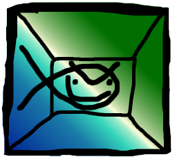

Every browser based game library sucks real bad real good UNTIL NOW... Wahooo,
we now have fish-tank; a browser based game library that takes loose
inspiration from lua love since it's real nice but not browser based obviously.

I guess another way of describing this library is that it's everything I ended
up implementing on top of other libraries implemented beforehand. The
interfaces are designed to be easy to use and not require reams of code, so
that you can make games quickly and with good code quality. For some reason or
other the web seems to hate both of those things.

Admittedly, if you want maximum control, you might find the way this engine's
interfaces work a little bit too friendly for your liking. All I can say is
enjoy writing your own engine because I don't care.

[Check out the demo](https://dalygbarron.github.io/fish-tank/test).

# Making a game with fish-tank
All the concepts talked about here can also be seen in the code of the demo
which can be found
[here](https://github.com/dalygbarron/fish-tank/tree/master/test).

Also, this is more meant to give you an idea of how the engine works and get
you off the ground. It's not 100% thorough because there is full up to date API
documentation that you can use to get the finer points through your skull.

## The HTML Page
I am going to make a yeoman generator for fish-tank projects, but until I do,
basically you are going to want to create an index containing a canvas with
a size fixed to whatever size you want. fish-tank does not handle resizing the
screen and it doesn't have capabilities for handling different sizes of screen.
Games must be built to have fixed dimensions. As you will see on the test
project, this doesn't mean that the canvas cannot be scaled via css to fill the
window, but the logical size from within the game engine should stay the same.

Yeah so once you have a page with a canvas, you need to include the code of
fish-tank, and you need to include your own code. Your own code needs to find
the canvas webgl context and the webaudio context and then pass them to the
engine along with the setting up stuff like so:

```javascript
window.onload = () => {
    const canvas = document.querySelector('#canvas');
    const gl = canvas.getContext('webgl2');
    const context = new AudioContext();
    if (gl === null || context === null) {
        alert('not compatible');
        return;
    }
    fish.start({
        rate: 30,
        gl: gl,
        ac: context,
        storePrefix: '/test/'
    }, init);
};
```

So, you can see we have gotten the webgl context and webaudio context and
passed them to fish.start which takes an object containing arguments, and
a function.

The arguments are documented elsewhere and fairly obvious, and the function is
one which returns a promise to create a {fish.screen.Screen}, the game's first
screen after the init/loading screen ends. In this init function you can
asynchronously load assets and whatever you want to do.

## The Screen Stack
Sections of games in fish-tank are divided into screens, you can transition
from one screen to another, but as well as that, you can place one screen on
top of another, meaning the top screen will run until it ends, then return
control to the screen beneath at the same point it was at before it placed the
other screen on top.

A screen can also return values to the screen below, much like function calls,
hence the term 'call stack'. For example, fish-tank has a built in
{fish.gui.GuiScreen} which is a screen that just displays a tree of gui
elements and when the gui elements generate a value, the screen pops itself
from the stack and returns the generated value to the screen below. This can be
used to pause the level while the user responds to dialogue, or whatever else
you want.

Screens transition by returning a {fish.screen.Transition} from their update
function. If you do not want to transition then return null.

## The GUI System aka Knobs
Fish-tank has a built in gui system which the demo program uses heavily. Before
you create any gui elements you need to set the global value
{fish.gui.defaultStyle} or the style that your created gui elements will have
will be undefined which ain't so good as it might crash the program or do
something stupid.

```javascript
class ButtonScreen extends fish.screen.Screen {
    constructor(ctx) {
        super(ctx);
        this.batch = new ctx.gfx.Batch(ctx.usr.texture, 512);
        fish.gui.defaultStyle = ctx.usr.style;
        this.button = new fish.gui.ButtonKnob('hello');
        this.button.fit(new fish.util.Rect(
            0,
            0,
            ctx.gfx.size.x,
            ctx.gfx.size.y
        );
    }

    update(delta) {
        this.button.update(this.ctx.in, this.ctx.snd, true);
    }

    render() {
        this.button.render(this.batch, true);
    }
}
```

Here is some code for a screen that fills the entire window with a big button
that says hello on it. You will notice that we make use of a variable called
ctx.usr.style, and one called ctx.usr.texture. ctx.usr is essentially a little
object where you can place any data your game is going to need all over the
place. Essentially this just means in a game engine this could would have
already loaded some texture and created a style.

First we set fish.gui.defaultStyle which is essential, then we create the
button object, then we fit the button. Fitting must be called on any tree of
gui knobs before they are updated or rendered. It is used to determine where
they appear on the screen. You simply set the boundaries for the parent gui
object and then rest are fitted in based on their size.

## Sprite Batching
Sprite Batching is a very genius technique for 2d rendering that allows you to
take advantage of the speed of hardware accelerated rendering while drawing in
roughly the same way you would with software rendering. This allows you to make
the code way cleaner and have to babysit a lot less state and junk.

```javascript
render() {
    batch.clear();
    for (let thing of things) batch.add(thing.sprite, thing.pos);
    batch.render();
}
```

This is the basic process for rendering with a batch. First you clear it to
remove any junk currently in it, then you add all of the things you want to
render, then you call batch.render to render all of them in a single draw call.

Now, of course there is a limitation which is that you need all of your images
to be sub images inside one texture, but you can see how the demo project uses
texture atlases to alleviate this. The first argument to batch.add is
a rectangle defining the portion of the batch texture to use.

It is worth pointing out if all your screens are using the same texture for
sprites, they can all use the same batch object. The only thing is make sure
you seperately call clear and render for each screen that uses it because
otherwise you will run into weird issues with drawing order when using
rendering techniques that do not use the batch (eg ctx.gfx.clear).
